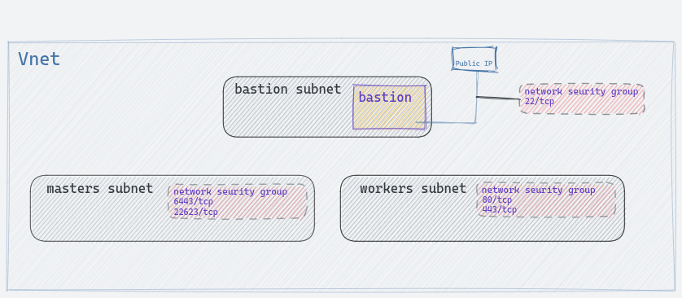
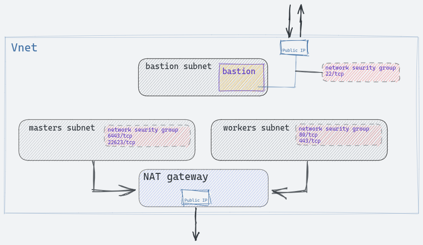
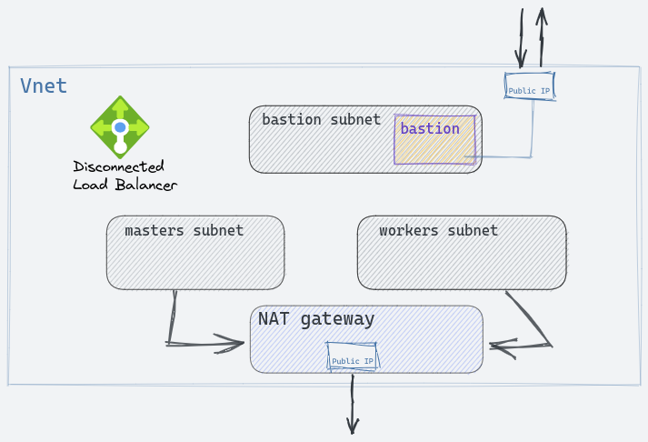

# Openshift 4 on Azure on existing VNet using IPI installer 

## Table of Contents
* [Introduction](#introduction)
* [Prerequisites](#prerequisites)
  * [Terraform installation](#terraform-installation)
  * [Creating a Service Principal ](#creating-a-service-principal) 
* [Outbound traffic configuration](#outbound-traffic-configuration)
* [Cluster Deployment Instructions](#cluster-deployment-instructions)
* [Create the infrastructure with Terraform](#create-the-infrastructure-with-terraform)
  * [Terraform initialization](#terraform-initialization)
  * [Login into Azure](#login-into-azure)
  * [Variables Definition for Terraform](#variables-definition-for-terraform)
  * [SSH key](#ssh-key)
  * [Deploy the infrastructure with Terraform](#deploy-the-infrastructure-with-terraform)
* [Bastion infrastructure](#bastion-infrastructure)
  * [Conditionally creating the bastion infrastructure](#conditionally-creating-the-bastion-infrastructure)
  * [Destroying the bastion infrastructure](#destroying-the-bastion-infrastructure)
* [Prepare the bastion host to install Openshift](#prepare-the-bastion-host-to-install-openshift)
* [OCP Cluster Deployment](#ocp-cluster-deployment)
  * [Accessing the Bootstrap Node](#accessing-the-bootstrap-node)
* [Cluster Decommission Instructions](#cluster-decommission-instructions)
* [Accessing a Private OpenShift Cluster from The Internet](#accessing-a-private-openshift-cluster-from-the-internet)
  * [Variables Definition for Ansible](#variables-definition-for-ansible)
    * [Obtaining the Load Balancers IP addresses](#obtaining-the-load-balancers-ip-addresses)
  * [Application Gateway Deployment](#application-gateway-deployment)
    * [Obtaining the Certificates for API and Application Secure Routes](#obtaining-the-certificates-for-api-and-application-secure-routes)
  * [Accessing the Openshift Cluster through the Application Gateway](#accessing-the-openshift-cluster-through-the-application-gateway)
  * [Updating the Configuration](#updating-the-configuration)
  * [Application Gateway Decommission](#application-gateway-decommission)
* [Configuring DNS resolution with dnsmasq](#configuring-dns-resolution-with-dnsmasq)
* [Obtaining Certificates from Let's Encrypt](#obtaining-certificates-from-lets-encrypt)

## Introduction

The instructions and code in this repository show how to create the basic Azure infrastructure neccessary to deploy an Openshift 4 IPI cluster.

The Openshift cluster deployed using this repository can be public or private:
* A [public](https://docs.openshift.com/container-platform/4.9/installing/installing_azure/installing-azure-vnet.html) cluster is fully accessible from the Internet.  
* A [private.](https://docs.openshift.com/container-platform/4.9/installing/installing_azure/installing-azure-private.html) cluster is only accessible from the same VNet where it is created unless additional configurations are put in place to allow clients to connect from other VNets or from the Internet.  This repository provides an [example of such configuration](#accessing-a-private-openshift-cluster-from-the-internet) using an [Azure Application Gateway](#https://docs.microsoft.com/en-us/azure/application-gateway/overview) to make the private cluster or parts of it public.  A private cluster must be installed from a bastion host connected to the same VNet where the cluster is created, so the installer can resolve the DNS records served by the private DNS zone.

    Some of the reasons to create a private cluster and then make it public instead of install it as a public cluster from the start are:

    * Hiding the complex DNS domain used by the cluster and instead publish a simpler one (myapp.apps.cluster1.example.com vs myapp.example.com). 
    * Limiting the number of public applications to a subset of the all applications running in the cluster. 
    * Keeping the API endpoint private. 
    * Keeping the cluster private until it is fully configured and ready for use. 
    * Hiding a multi cluster infrastructure behind a single point of access.

In regards to the outgoing network traffic, the Openshift cluster created using this repository can connect to external Internet services, this simplifies installation and container image pulling from external repositories.  Two possible configuration options for outgoing network traffic can be used here: 
* Load Balancer.- The Openshift installer creates a load balancer with outbound rules to allow connections from the cluster to the Internet
* NAT Gateway.- Terraform creates a NAT gateway to allow outgoing network traffic from the cluster to the Internet.
For more details on this see the section [Outbound traffic configuration](#outbound-traffic-configuration).

The Azure resources required to deploy the OCP cluster are created using terraform, these include: 
* Resource Group.- Contains the following resources
* VNet
* Subnets.- One for the control plane (masters), one for the worker nodes, and one for the bastion host if this is created.
* Network security groups.- One for each of the above subnets with its own security rules.



* If [outboundType](#outbound-traffic-configuration) is set to UserDefinedRouting, a NATGateway for the outbound network traffic from the cluster nodes to the Internet



To let the IPI installer know that the above resources already exist and should not be created during cluster installation, the following variables must be defined in the __platform.azure__ section in the install-config.yaml file:

* networkResourceGroupName.- Contains the name of the resource group where the previously mentioned, user provided network resources exist.
* virtualNetwork.- The name of the VNet to be used
* controlPlaneSubnet.- The name of the subnet where master nodes will be deployed
* computeSubnet.- The name of the subnet where worker nodes will be deployed
* outboundType.- The type of [outboundType](#outbound-traffic-configuration) network configuration to use

```
...
platform:
  azure:
    networkResourceGroupName: ocp4-resogroup-gohtd
    virtualNetwork: vnet-gohtd
    controlPlaneSubnet: masters-gohtd
    computeSubnet: workers-gohtd
    outboundType: Loadbalancer
...
```
## Prerequisites
Before attempting to deploy the Openshift cluster make sure to fulfill the following prerequisites:
* If the cluster being installed is public, a similarly public DNS zone must exist in Azure, and the account used to install the cluster must have permissions to create records in it. [More details](https://docs.openshift.com/container-platform/4.9/installing/installing_azure/installing-azure-account.html#installation-azure-network-config_installing-azure-account). If the cluster is private no DNS public zone is required.
* The default limits in a newly created Azure account are too low to deploy an Openshift cluster, make sure these limits have been extended. [More details](https://docs.openshift.com/container-platform/4.9/installing/installing_azure/installing-azure-account.html#installation-azure-limits_installing-azure-account)
* Create a service principal with the roles of _Owner_ and _User Access Administrator_, and use it to deploy the Openshift cluster. [Creating a Service Principal](#creating-a-service-principal)
* A working terraform installation in the host where the infrastructure is going to be deployed from. [Terraform installation](#terraform-installation)
* A working ansible installation in the host where the infrastructure is going to be deployed from.

### Terraform installation

The terraform installation is straight forward, just follow the instructions for your operating system in the [terraform site](https://www.terraform.io/downloads.html)

Verify that terraform works:

```shell
 # terraform --version
```
### Creating a Service Principal 
For more details visit the [official Openshift documentation](https://docs.openshift.com/container-platform/4.9/installing/installing_azure/installing-azure-account.html#installation-azure-service-principal_installing-azure-account)

These instructions use the [az] (https://docs.microsoft.com/es-es/cli/azure/install-azure-cli) command line tool:

* Log into Azure:

        az login

* Create the service principal and assign it the _Contributor_ role.  The expiration date for the secret associated with the SP is set to 20 years to avoid problems with expired credentials after one year.  In this example the service principal is named *ocp_install_sp*. 

    The creation of the service principal will generate a secret to authenticate it with Azure Active Directory, by default this secret is valid for one year which is a short time for most clusters, to avoid this limitation a expiry date of 20 years is used here.  

    Save the _appId_ and password values, they are needed in the following steps:

        $ az ad sp create-for-rbac --role Contributor --name ocp_install_sp --years 20
        {
          "appId": "2bbe757d-a3f4-45eb-8a83-52e3c67e6ac7",
          "displayName": "ocp49-installer",
          "name": "2bbe757d-a3f4-45eb-8a83-52e3c67e6ac7",
          "password": "sxrw.jIBc~4qigF0Yn84Vkj7~PhN0_LCHa",  # gitleaks:allow
          "tenant": "46dc81a2-d083-ff32-3801-abacc1dd1408"
        }

 
* Assign the _User Access Administrator_ role to the service principal just created. Replace \<appId\> with the value obtained in the first command:

        $ az role assignment create --role "User Access Administrator" \
        --assignee-object-id $(az ad sp list --filter "appId eq '<appId>'" \ 
        | jq '.[0].objectId' -r)

        {
          "canDelegate": null,
          "condition": null,
          "conditionVersion": null,
          "description": null,
          "id": "/subscriptions/aab9382c-c711-33a1-b670-05f6677b3e2a/providers/Microsoft.Authorization/roleAssignments/4aed0546-ef0f-46fc-8258-d838d98caff2",
          "name": "4aed0546-ef0f-46fc-8258-d838d98caff2",
          "principalId": "253c270e-4bd4-4dc4-8bb1-75809b41adbb",
          "principalType": "ServicePrincipal",
          "roleDefinitionId": "/subscriptions/aab9382c-c711-33a1-b670-05f6677b3e2a/providers/Microsoft.Authorization/roleDefinitions/81d7d88d-d53e-4f5b-ac53-7113c20a72d9",
          "scope": "/subscriptions/aab9382c-c711-33a1-b670-05f6677b3e2a",
          "type": "Microsoft.Authorization/roleAssignments"
        }

## Outbound traffic configuration
The network configuration and resources required to allow the cluster nodes to connect to the Internet (outbound traffic) depend on the value of the terraform variable __outboundType__. This configuration is independent from that of the inbound cluster traffic that defines whether this is a public or private cluster.  For more details see [Variables Definition for Terraform](#variables-definition-for-terraform)

The __outboundType__ variable can take one of two possible values:
* **LoadBalancer**.- The IPI installer creates an outbound rule in the public load balancer to allow outgoing connections from the nodes to the Internet.  If the cluster is public, the load balancer is used for routing both inbound traffic from the Internet to the nodes and outbound traffic from the nodes to the Internet.  If the cluster is private there is no inbound traffic from the Internet to the nodes, but the load balancer is still created, but only used for outbound traffic from the nodes to the Internet.



* **UserDefinedRouting**.- The infrastructure and configuration necessary to allow the cluster nodes to connect to the Internet must be in place before running the IPI installer, different options exist in Azure for this: NAT gateway; Azure firewall; Proxy server; etc. In this project the terraform template creates a NAT gateway for this purpose. 

     When using _UserDefinedRouting_ in a private cluster, a load balancer is still created by the IPI installer, but contains no frontend IP address, load balancing rules or outbound rules, so it serves no purpose.  A fully functional internal load balancer is always created for access to the API service and applications only from inside the VNet.


## Cluster Deployment Instructions

The deployment process consists of the following points:

* [Create the infrastructure components in Azure](#create-the-infrastructure-with-terraform).- The VNet and other components are created using terraform.
* [Set up installation environment](#prepare-the-bastion-host-to-install-openshift).- The bastion host is prepared to launch the openshift installer from it.
* [Run the Openshift installer](#ocp-cluster-deployment)

### Create the infrastructure with Terraform
Terraform is used to create the Azure network infrastructure resources required to deploy the Openshift 4 cluster.  The [terraform Azure provider](https://registry.terraform.io/providers/hashicorp/azurerm/latest/docs) is used.  

#### Terraform initialization

Check for any updates and initialize terraform plugins and modules:

```shell
  $ cd Terraform
  $ terraform init
  
  Initializing the backend...
  
  Initializing provider plugins...
  - Finding latest version of hashicorp/aws...
  - Finding latest version of hashicorp/random...
  - Installing hashicorp/aws v3.65.0...
  - Installed hashicorp/aws v3.65.0 (signed by HashiCorp)
  - Installing hashicorp/random v3.1.0...
  - Installed hashicorp/random v3.1.0 (signed by HashiCorp)
  
  Terraform has created a lock file .terraform.lock.hcl to record the provider
  selections it made above. Include this file in your version control repository
  so that Terraform can guarantee to make the same selections by default when
  you run "terraform init" in the future.
  
  Terraform has been successfully initialized!
  
  You may now begin working with Terraform. Try running "terraform plan" to see
  any changes that are required for your infrastructure. All Terraform commands
  should now work.
  
  If you ever set or change modules or backend configuration for Terraform,
  rerun this command to reinitialize your working directory. If you forget, other
  commands will detect it and remind you to do so if necessary.
```

#### Login into Azure
Before running terraform to create resources, a user with enough permissions must be authenticated with Azure, there are several options to perform this authentication as explained in the terraform [documentation](https://registry.terraform.io/providers/hashicorp/azurerm/latest/docs/guides/service_principal_client_certificate) for the Azure resource provider.  The simplest authentication method uses the Azure CLI:

* Install the __az__ [client](https://docs.microsoft.com/en-us/cli/azure/install-azure-cli). On [RHEL](https://docs.microsoft.com/en-us/cli/azure/install-azure-cli-linux?pivots=dnf#install)

* Login to azure with:
```  
$ az login
```  
Once successfully logged in, the file __~/.azure/azureProfile.json__ is created containing credentials that are used by the __az__ CLI and terraform to run commands in Azure.  These credentials are valid for a few days so no further authentication with Azure is required for a while.

#### Variables Definition for Terraform
Some of the resources created by terraform can be adjusted via the use of variables.  These variables can be defined in the command line or in a file:
* **cluster_name**.- A unique name for the Openshift cluster.  

    No default value so it must be specified everytime the _terraform_ command is executed. 

        cluster_name = "jupiter"

* **region_name**.- Contains the short name of the Azure region where the resources, and the Openshift cluster, will be created. The short name of the regions can be obtained from the __Name__ column in the output of the command `az account list-locations -o table`.  

    No default value so it must be specified everytime the _terraform_ command is executed. 

        region_name = "francecentral"

* **create_bastion**.- Boolean used to determine if the bastion infrastructure will be created or not.

    Default value **true**

        create_bastion = false

* **cluster_scope**.- Is the OCP cluster public (accessible from the Internet) or private (not accessible from the Internet).

    Possible values: _public_ or _private_.

    Default value: _public_

        cluster_scope = "public"

* **outbound_type**.- Defines the networking method that cluster nodes use to connect to the Internet (outbound traffic).  

    Possible values: 

    * __LoadBalancer__, the installer creates a load balancer with outbound rules, even if the cluster scope is private

    * __UserDefinedRouting__, the outbound rules in the load balancer are not be created and the user must provide the outbound configuration, in this repository terraform creates a NAT gateway".  

    Default value:_LoadBalancer_.

        outbound_type = "LoadBalancer"

#### SSH key
Regardless of whether the the bastion infrastructure is going to be created or not ([Conditionally creating the bastion infrastructure](#conditionally-creating-the-bastion-infrastructure)), an ssh key is needed to connect to the bastion VM and the OCP cluster nodes.

Terraform expects a file containing the public ssh key at __Terraform/Bastion/ocp-install.pub__.  This can be an already existing ssh key or a new one can be [created](https://docs.openshift.com/container-platform/4.9/installing/installing_azure/installing-azure-private.html#ssh-agent-using_installing-azure-private):

```
$ ssh-keygen -o -t rsa -f ocp-install -N "" -b 4096
```
The previous command generates two files: ocp-install containing the private key and ocp-install.pub containing the public key.  The private key is not protected by a passphrase.

#### Deploy the infrastructure with Terraform
To create the infrastructure run the __terraform apply__ command.  Enter "yes" at the prompt:

```  
$ cd Terraform
$ terraform apply -var region_name="uksouth" -var cluster_name="boxhill" -var cluster_scope=private -var outbound_type="UserDefinedRouting"
...
Do you want to perform these actions?
  Terraform will perform the actions described above.
  Only 'yes' will be accepted to approve.

  Enter a value: yes
```  
Alternatively if the variables were defined in a file called *infra_vars* use a command like:
```  
$ cat infra_vars 
cluster_name = "bell"
region_name= "westeurope"
create_bastion = true
cluster_scope = "private"
outbound_type = "LoadBalancer"

$ terraform apply -var-file infra_vars
```  

Resource creation is completed successfully when a message like the following appears:
```  
Apply complete! Resources: 9 added, 0 changed, 0 destroyed.

Outputs:
...
```  
Save the command used to create the infrastructure for future reference.  The same variable definitions must be used when [destroying the resources](#cluster-decommissioning-instructions).

```  
$ echo "!!" > terraform_apply.txt
```  
## Bastion Infrastructure
Reference documentation on how to create the VM with terraform in Azure: \[[1](https://docs.microsoft.com/en-us/azure/developer/terraform/create-linux-virtual-machine-with-infrastructure)\] and \[[2](https://registry.terraform.io/providers/hashicorp/azurerm/latest/docs/resources/linux_virtual_machine)\]

In the default configuration, with variable `create_bastion=true`, a bastion host is created in its own subnet and gets assigned a network security rule that allows ssh connections into it.  It is intended to run the OCP 4 installer from it, and once the OCP cluster is installed it can be used to access the cluster using the __oc__ cli.

The bastion infrastructure is created from a module in terraform so it can be [conditionally created](#conditionally-creating-the-bastion-infrastructure) and [easily destroyed](#destroying-the-bastion-infrastructure) once it is not needed anymore.

The bastion VM gets both public and private IP addresses assigned to its single NIC. The network security group is directly associated with this NIC.

The operating system disk image used in the bastion VM is the latest version of RHEL 8.  The same definition can be used irrespective of the region where the resources will be deployed.  The az CLI commands used to collect the information for the definition can be found [here](https://docs.microsoft.com/en-us/cli/azure/vm/image?view=azure-cli-latest), for example:

```
$ az vm image list-publishers
$ az vm image list-offers -l "West Europe" -p RedHat
$ az vm image list-skus -l "West Europe" -p RedHat -f rh_rhel_8_latest
$ az vm image list -l "West Europe" -p RedHat --all -s 8-lvm-gen2
$ az vm image show -l "West Europe" -p RedHat -s 8-lvm-gen2 -f RHEL --version "8.5.2021121504"
```

To access the bastion VM using ssh, a public ssh key is injected during creation, this ssh key is expected to be found in a file called __ocp-install.pub__ in the __Terraform/Bastion__ directory.

### Conditionally creating the bastion infrastructure
A boolean variable is used to decide if the bastion infrastructure will be created or not.  The bastion infrastructure may not be required for example because the Openshift installer is going to be run from an already existing host.

The variable is called __create_bastion__ and its default value is __true__, the bastion will be created, to skip the creation of the bastion infrastructure assign the value __false__ to the variable:

```
$ terraform apply -var="create_bastion=false"
```

WARNING.  Once the resources are created, the Terraform directory contains the state information that would be required to update or remove these resources using terraform.  Keep this directory and its files safe.

### Destroying the bastion infrastructure
The bastion infrastructure is created by an independent module so it can be destroyed without affecting the rest of the resources.  This is useful to reduce costs and remove unused resources once the Openshift cluster has been deployed.

WARNING. Before removing the bastion virtual machine backup the OCP4 directory from which the Openshift installer was run, this is required to orderly remove the Openshift cluster.  Treat this backup as sensitive information as this contains the kubeadmin password and an X509 certificate which can be used to access the cluster with admin privileges.

The command to destroy only the bastion infrastructure is:
```
$ terraform destroy -target module.bastion
```
__WARNING__ If the __-target__ option is not used, terraform will delete all resources.

The option `-target module.<name>` is used to affect only a particular module in the terraform command

## Prepare the bastion host to install Openshift
Ansible is used to prepare the bastion host so the Openshift 4 installation can be run from it.  Before running the playbook some prerequisites must be fulfilled:

Define the following variables in the file **Ansible/group_vars/all/cluster-vars**:
* **DNS base domain**.- This domain is used to access the Openshift cluster and the applications running in it.  In the case of a _public_ cluster, this domain must exist in an Azure DNS public zone.  In the case of a private cluster, a private domain is created and there is no need to own that domain since it will only exist in the private VNet where the cluster is deployed.  

    The full DNS domain for the OCP cluster is built as `<cluster name>.<base domain>` so for example if cluster name is __jupiter__ and base domain is __example.com__ the full cluster DNS domain is __jupiter.example.com__.  

    Assign the domain name to the variable **base_domain**.
```
base_domain: example.com
```
* **Base domain resource group**.- The Azure resource group name where the base domain exists.  In a private cluster this variable is not required.  Assign the name to the variable **base_domain_resource_group**
```
base_domain_resource_group: waawk-dns
```
* **Number of compute nodes**.- The number of compute nodes that the installer will create. Assign the number to the variable **compute_replicas**.
```
compute_replicas: 3
```
* **ocp_version**.- Openshift version to be deployed.  Available versions can be found [here](https://mirror.openshift.com/pub/openshift-v4/x86_64/clients/ocp/)
```
ocp_version: 4.9.5
```
The resulting file will look like:
```
base_domain: example.com
base_domain_resource_group: waawk-dns
compute_replicas: 3
ocp_version: 4.9.5
```
Download the Pull secret as a file from [here](https://cloud.redhat.com/openshift/install): In section __Run it yourself__, select **Azure (x86_64)** as the cloud provider, then **Installer-provisioned infrastructure**.

Save the pull secret in a file called **pull-secret** to the directory __Ansible/ocp_files/__
```
cp pull-secret.txt Ansible/ocp_files/pull-secret
git restore README.md
```
The ansible inventory file containing the _[bastion]_ group is created by the ansible playbook itself so there is no need to create this file before running the playbook.

The same ssh public key used for the bastion host is injected into the Openshift cluster nodes, there is no need to provide a specific one.

Run the playbook:
```
cd Ansible
ansible-playbook -vvv -i inventory setup_bastion.yaml
```
If anything goes wrong during the playbook execution, the messages generated by ansible can be found in the file __Ansible/ansible.log__

## OCP Cluster Deployment
Ssh into the bastion host. Connect as the user __azureuser__, use its public IP and the private part of the ssh key installed in the bastion VM.  The bastion's IP can be found in several places, for example in the terraform output:
```
$ cd Terraform
$ terraform output bastion_public_ip
20.43.63.15
$ ssh -i ~/.ssh/ocp_install azureuser@20.43.63.15
```
The Openshift installer and oc cli are in __/usr/local/bin__.  A directory with the cluster name should be found inside the _OCP4_ directory:
```shell
$ ls /usr/local/bin
README.md  kubectl  oc  openshift-install
$ cd OCP4
$ ls -F
jupiter/
```
The directory contains the configuration file __install-config.yaml__, review and modify the file as required.

Before running the installer, backup the install-config.yaml because it is removed during the installation process.  It is also recommended to run the installer in a tmux session so the terminal doesn't get blocked for more than 40 minutes, which is the time the installation needs to complete.

```
$ cp jupiter/install-config.yaml .
$ tmux
```
When the Openshift installer is execute, it requests the following information:

* The Azure subscription ID used to create the resources.  Found in the **Subscriptions** section in the Azure web site.
* The Azure tenant id associated with the service principal used to create resources in Azure.  Found in the Active Directory section, look for **Tenant ID**.  Also found in the **App registrations** section inside Active Directory, for the particular service principal used.  Look for **Directory (tenant) ID**.
* The Service principal client id.  Found in the **App registrations** section inside Active Directory, for the particular service principal used.  Look for **Application (client) ID**
* The Service principal secret password for the service principal used.  Found in the **App registrations** section inside Active Directory, for the particular service principal used.  Look for **Client credentials**.  If none exists or the password **Value** is obfuscated, a new one can be created by clicking on **New client secret**

After providing the values, the installer starts creating the cluster components:
```
$ openshift-install create cluster --dir jupiter
? azure subscription id 9cf87ea-3bf1-4b1a-8cc3-2aabe4cc8b98
? azure tenant id 6d4c6af4-d80b-4f9a-b169-4b4ec1aa1480
? azure service principal client id 0c957bc0-fbf9-fa60-6a5e-38a8bcc2e919
? azure service principal client secret [? for help] **********************************
INFO Saving user credentials to "/home/azureuser/.azure/osServicePrincipal.json" 
INFO Credentials loaded from file "/home/azureuser/.azure/osServicePrincipal.json" 
INFO Consuming Install Config from target directory 
INFO Creating infrastructure resources...
```
Alternatively an existing _osServicePrincipal.json_ file containing the [service principal](#creating-a-service-principal) credentials can be copied to the bastion host and placed at _/home/azureuser/.azure/osServicePrincipal.json_.  In this case the Openshift installer will not ask for the credentials and use the file instead.

The installation process will take more than 40 minutes.  The progress can be followed by tailing the *.openshift_install.log* :
```
$ tail -f OCP4/jupiter/.openshift_install.log
```
### Accessing the Bootstrap Node
In the first stages of the installation process a bootstrap node is created.  Sometimes it maybe desired to connect to this bootstrap node to watch this part of the installation or for debugging reasons.

The IPI installer creates a network security group and adds a rule to allow ssh connection to the bootstrap node, however in an installation where the VNet, subnets, network security groups, etc. are provided by the user, the network security group created by the IPI installer is only applied to the bootstrap's network interface and not to the subnet where it is "connected".

On the other hand, the network security group created by terraform in this repository does not contain a similar security rule allowing ssh connections to the bootstrap host, this is to increase security, specially considering that the bootstrap node is ephemeral and will be destroyed after it serves it purpose.

The bootstrap node is therefore not accessible via ssh from the Internet.

It is possible to ssh into the bootstrap from the bastion host, if this was created, or from any other VM running in the same VNet:
* Connect to the bastion host using ssh

        $ ssh -i ~/.ssh/ocp_install azureuser@20.43.63.15

* Get the private IP of the bootstrap node.  This can be easily found in the Azure portal for example.

* Connect to the bootstrap node

        $ ssh core@10.0.1.5

## Cluster Decommission Instructions
Deleting the cluster is a multi step process:

* Delete the components created by the __openshift-install__ binary. Run this command in the directory where the installation was executed from.  If the installation was run in the bastion host and it has been previously deleted, recover a backup of the __/home/azureuser/OCP4__ directory containing the status files required by the Openshift installer:
```
$ ./openshift-install destroy cluster --dir jupiter
```
* Delete the components created by terraform, use the `terraform destroy` command with the same variable definitions that were used when the resources were created. This command should be run from the same directory where the `terraform apply` command was run:
```
cd Terraform
terraform destroy -var-file infra_vars
```
Or in case the variables where defined directly in the command line:
```
terraform destroy -var region_name="germanywestcentral" -var cluster_scope="private"
```
* If an [Application Gateway](#accessing-a-private-openshift-cluster-from-the-internet) has been created using the terraform module in this repository, remove it following the instructions in [this section ](#application-gateway-decommission)

## Accessing a Private OpenShift Cluster from The Internet
If the Openshift cluster deployed following the instructions in this repository is private, the API and any applications deployed in it are not accessible from the Internet.  This may be the desired state right after installation, but at a later time, when the cluster is fully set up and production applications are ready, it may be the case that a particular set of applications and even the API endpoint are expected to be publicly available.  

There are many options to make the applications and API endpoint publicly available, this repository includes a terraform module that can be used for such purpose.  This module creates an [Azure application gateway](https://docs.microsoft.com/en-us/azure/application-gateway/) that provides access to the applications running in the cluster, and optionally to the API endpoint.

To successfully deploy the Application Gateway using the terraform template in this repository, the Azure infrastructure must also be deployed using the terraform templates in this repository, and the Openshift cluster must be already fully and successfully deployed.

### Variables Definition for Ansible
The following variables are used to pass information to terraform so the Application Gateway can be created and set up.  Add the variables definition to a file in the __Terraform/AppGateway__ directory, for example **AppGateway_vars**, and later call it in with the option `-var-file AppGateway_vars`.

* **publish_api**.- This boolean variable determines if the API entry point is to be published or not.  

    This variable is not required since it has a default value.

    Default value is __false__, the API endpoint will not be made public.
```
publish_api = true
```
* **api_lb_ip**.- Private IP of the internal load balancer used for API access.  See [Obtaining the Load Balancers IP addresses](#obtaining-the-load-balancers-ip-addresses) to learn how to obtain this IP.

    This variable is not required if the API endpoint is not going to be made public.  

    No default value.
```
api_lb_ip = "10.0.1.4"
```
* **apps_lb_ip**.- Private IP of the internal load balancer used for application access.  See [Obtaining the Load Balancers IP addresses](#obtaining-the-load-balancers-ip-addresses) to learn how to obtain this IP.

    This variable is always required.  

    No default value.
```
apps_lb_ip = "10.0.2.8"
```
* **api_cert_passwd**.- The password that was used to encrypt the PKCS12 certificate file for the API listener.  See [Obtaining the certificate for api and application secure routes](#obtaining-the-certificates-for-api-and-application-secure-routes)

    This variable is not required if the API endpoint is not going to be made public.

    No default value.
```
api_cert_passwd = "l3l#ah91"
```
* **apps_cert_passwd**.- The password that was used to encrypt the PKCS12 certificate file for the APPS listener.  See [Obtaining the certificate for api and application secure routes](#obtaining-the-certificates-for-api-and-application-secure-routes)

    This variable is always required.

    No default value.
```
apps_cert_passwd = "er4a9$C"
```
* **ssl_listener_hostnames**.- List of external FQDN hostnames used to access the secure application routes.  External and internal domains don't need to match (see [Accessing the Openshift Cluster through the Application Gateway](#accessing-the-openshift-cluster-through-the-application-gateway) for more information).  If this variable is not defined, no secure routes will be published.

    This variable is not required.

    No default value.
```
ssl_listener_hostnames = [ "oauth-openshift.apps.jupiter.example.com",
                          "console-openshift-console.apps.jupiter.example.com",
                          "console-openshift-console.tale.net",
                          "grafana-openshift-monitoring.apps.jupiter.example.com",
                          "prometheus-k8s-openshift-monitoring.apps.jupiter.example.com",
                          "examplessl-dragon.tale.net",
                        ]
```
* **cluster_domain**.- DNS domain used by cluster.  Consists of *cluster_name* + *cluster_domain*.  

    This variable is always required.

    No default value.
```
cluster_domain = "jupiter.example.com"
```

#### Obtaining the Load Balancers IP addresses
The variables *api_lb_ip* and *apps_lb_ip* described in [Variables Definition for Ansible](#variables-definition-for-ansible) can be obtained from the Azure portal or using the following commands:

* Get the list of load balancers in the resource group created by the IPI installer.  The LB with _internal_ in its name is the one of interest here, the other LB is not even functional in a private cluster:
```
$ az network lb list -g lana-l855j-rg -o table
Location            Name                 ProvisioningState    ResourceGroup    ResourceGuid
------------------  -------------------  -------------------  ---------------  ------------------------------------
germanywestcentral  lana-l855j           Succeeded            lana-l855j-rg    73c41f07-886c-46f1-b4cc-007b64924ff4
germanywestcentral  lana-l855j-internal  Succeeded            lana-l855j-rg    9a4d37c9-b139-479b-9905-e12743a3ac47
```
* Get the frontend IPs associated with the internal LB, the one with the name _internal-lb-ip-v4_ is the IP for the API endpoint, the one with the long string of random characters is the IP for application access:
```
$ az network lb frontend-ip list -g lana-l855j-rg --lb-name lana-l855j-internal -o table
Name                              PrivateIpAddress    PrivateIpAddressVersion    PrivateIpAllocationMethod    ProvisioningState    ResourceGroup
--------------------------------  ------------------  -------------------------  ---------------------------  -------------------  ---------------
internal-lb-ip-v4                 10.0.1.4            IPv4                       Dynamic                      Succeeded            lana-l855j-rg
a0a66b12128ec4f33bbf3fb705e48e9e  10.0.2.8            IPv4                       Dynamic                      Succeeded            lana-l855j-rg
```
  Further details for the IPs can be obtained using a command like:
```
$ az network lb frontend-ip show -g lana-l855j-rg --lb-name lana-l855j-internal -n internal-lb-ip-v4|jq
```

### Application Gateway Deployment

The commands explained in this section must be run in the directory __Terraform/AppGateway__, in the same copy of the repository that was used to deploy the infrastructure used to install the Openshift cluster, this is because the AppGateway terraform module consumes information generated by terraform in its previous execution.

Follow the next steps to create the Application Gateway:

* Create a file to hold the variables detailed in the [Variables Definition for Ansible](#variables-definitionfor-ansible) section, for example *AppGateway_varsf*.

* Choose whether the API endpoint will be made public or not by assigning _true_ or _false_ to the variable **publish_api**, _false_ being the default value.

    If the API will not be public the following variables don't need to be defined: **publish_api**; **api_lb_ip**; **api_cert_passwd**.  The certificate file __api-cert.pfx__ is also not required in this case.

    The API endpoint can be publish or unpublish at anytime just by changing the value of the **publish_api** variable and rerunning the AppGateway terraform module.  In case of publishing the API, the variables **api_lb_ip**; **api_cert_passwd** must be defined and the certificate file __api-cert.pfx__ must be put in place.

* Obtain the IP addresses to assign to **apps_lb_ip**, and to **api_lb_api** if required, instructions on how to get this information can be found in the section [Obtaining the Load Balancers IP addresses](#obtaining-the-load-balancers-ip-addresses).

* Define the variable **ssl_listener_hostnames** with a list of external FQDNs hostnames defining the secure application routes to be published using the _https_ protocol, as described in the section [Variables Definition for Ansible](#variables-definition-for-ansible) 

    If additional secure routes are required at a later time, just add new entries to the list and rerun the AppGateway terraform module.

* Define the variable **cluster_domain** with the internal DNS domain used by the Openshift cluster.

* Obtain the certificates required to encrypt the secure connections with the cluster.  Two sets of certificates are required, one for the API endpoint and another for the applications using secure routes.  If the API endpoint is not public, its certificate set is not required.  See [Obtaining the Certificates for API and Application Secure Routes](#obtaining-the-certificates-for-api-and-application-secure-routes). 

    The terraform template expects to find the API endpoint PKCS12 certificate in a file called __api-cert.pfx__ and the PKCS12 certificate for application secure routes in a file called __apps-cert.pfx__, both in the directory __Terraform/AppGateway__.

A complete variables file example looks like this:
```
$ cat AppGateway_vars
publish_api = true
api_lb_ip = "10.0.1.4"
apps_lb_ip = "10.0.2.8"
api_cert_passwd = "l3l#ah91""
apps_cert_passwd = "er4a9$C""
ssl_listener_hostnames = [ "oauth-openshift.apps.jupiter.example.com",
                          "console-openshift-console.apps.jupiter.example.com",
                          "console-openshift-console.tale.net",
                          "grafana-openshift-monitoring.apps.jupiter.example.com",
                          "prometheus-k8s-openshift-monitoring.apps.jupiter.example.com",
                          "examplessl-dragon.tale.net",
                        ]
cluster_domain = "jupiter.example.com"
```
And the folder __Terraform/AppGateway__ contains:
```
$ ls -1 Terraform/AppGateway/
api-cert.pfx
api-root-CA.cer
AppGateway_input-vars.tf
AppGateway-main.tf
AppGateway_vars
apps-cert.pfx
apps-root-CA.cer
```
When the variables are defined and the certificate files are in place the Application Gateway can be deployed with the command:
```
$ terraform apply -var-file AppGateway_vars
```
The deployment will take a few minutes, but it could take a little longer to be operational until the health probes verify that the backend pools can receive requests.

To access the cluster check the section [Accessing the Openshift Cluster through the Application Gateway](#accessing-the-openshift-cluster-through-the-application-gateway).

#### Obtaining the Certificates for API and Application Secure Routes
Connections to the API and the secure application routes are encrypted end to end, from the client to the Openshift cluster.  The Application Gateway terminates all TLS connections and establishes new ones with the OCP cluster.  

To establish the encrypted end to end connections for API and secure routes two certificates are required:
* **A PKCS12 (PFX) file**.- Contains the public and private parts of the certificate used to encrypt connections between clients and the application gateway.  

    The Application Gateway terminates the TLS connections so it needs a full certificate, containing the private and public keys.  

    This certificate can be obtained from a well known certification authority or generated internally.  This instructions show how to extract the certificates from the Openshift cluster API endpoint and the default ingress controller.  A new certificate created by a CA is also valid, see [Obtaining Certificates from Let's Encrypt](#obtaining-certificates-from-lets-encrypt) for an example on how to obtain these certificates from a well known Certification Authority.

    The certificate used to access application secure routes should be valid for the DNS domain of the applications, but the external and internal domains don't need to be the same, for example the external hostname of an application could be _app1.example.com_ and its internal name _app1.apps.ocp4.jupiter.net_, this provides a layer of abstraction that can hide the complexities of the OCP cluster behind the application gateway and can simplify the migration of applications from one cluster to another.  

    This repository only supports wildcard certificates for applications in the DNS domain for which the certificate is valid.  A wildcard certificate contains a CN field and possibly a SAN field like in the following example:

        Subject: CN = *.apps.jupiter.example.com
        ...
        X509v3 Subject Alternative Name: 
            DNS:*.apps.jupiter.example.com

    **The API endpoint certificate** components can be extracted by running the following command.  The command generates the files __tls.crt__ and __tls.key__.

        $ oc extract secret/external-loadbalancer-serving-certkey -n openshift-kube-apiserver
        tls.crt
        tls.key

    To build the PKCS12 (PFX) file required by the Application Gateway use the following command. The password requested by the command is used to encrypt the resulting _api-cert.pfx_ file, and must be assigned to the variable **api_cert_passwd**:

        $ openssl pkcs12 -export -out api-cert.pfx -inkey tls.key -in tls.crt
        Enter Export Password:
        Verifying - Enter Export Password:

    **The certificate for the secure routes** can be extracted running the following command, the __--confirm__ option is used to overwrite the files if they already exist.

        $ oc extract secret/router-certs-default -n openshift-ingress --confirm
        tls.crt
        tls.key

   To build the PKCS12 (PFX) file the following command is used, the password provided must be assigned to the variable **apps_cert_passwd**:

        $ openssl pkcs12 -export -out apps-cert.pfx -inkey tls.key -in tls.crt 
        Enter Export Password:
        Verifying - Enter Export Password:

   The terraform template expects to find the API endpoint PKCS12 certificate in a file called __api-cert.pfx__ and the PKCS12 certificate for application secure routes in a file called __apps-cert.pfx__, both in the directory __Terraform/AppGateway__.
   
* **An x509 certificate file**.- This file must contain the public part of the Certification Authority (CA) certificate used to sign the certificate served by the API endpoint and Openshift ingress controller respectively.  This certificate is used to verify the authenticity of the x509 certificate shown by the API endpoint and the ingress controller when an encrypted connection is established between the Application Gateway and the API endpoint or the ingress controller. 

    This certificate must be extracted from the OCP cluster.  In these instructions the _openssl_ tool is used to obtain these certificates.

    **To obtain the CA certificate from the API endpoint** use a command like the following.  This certificate is not required if the API endpoint is not public.  Replace the cluster domain name in the example for that of the actual cluster.  

    This command must be run from the bastion host so the internal DNS domain can be resolved.

    The output contains, among other information, a certificate chain:

        $ echo |openssl s_client -showcerts -connect api.jupiter.example.com:6443
        ...
         1 s:OU = openshift, CN = kube-apiserver-lb-signer
           i:OU = openshift, CN = kube-apiserver-lb-signer
        -----BEGIN CERTIFICATE-----
        MIIDMjCCAhqgAwIBAgIISzOKW4LZ2kIwDQYJKoZIhvcNAQELBQAwNzESMBAGA1UE
        CxMJb3BlbnNoaWZ0MSEwHwYDVQQDExhrdWJlLWFwaXNlcnZlci1sYi1zaWduZXIw
        ...
        HYU2RTQxsBRlL016bi8q57oMn0S8/yMRYTRTu+CWQrZvI31+FaSBB2kvHoXvjtxm
        JtOIcSESjVbTWTeNwAj5BE9FHvH44FjsVb49kaLTj5bdsYMbrxaoW5IpPKIIHKyx
        8GJ8frRz
        -----END CERTIFICATE-----

    Copy the certificate in which the issues and subject are the same **CN=kube-apiserver-lb-signer** 

        s:OU = openshift, CN = kube-apiserver-lb-signer
        i:OU = openshift, CN = kube-apiserver-lb-signer

    And paste it into a file called **api-root-CA.cer**:

        $ echo "-----BEGIN CERTIFICATE-----
        > MIIDMjCCAhqgAwIBAgIISzOKW4LZ2kIwDQYJKoZIhvcNAQELBQAwNzESMBAGA1UE
        > CxMJb3BlbnNoaWZ0MSEwHwYDVQQDExhrdWJlLWFwaXNlcnZlci1sYi1zaWduZXIw
        ...
        > HYU2RTQxsBRlL016bi8q57oMn0S8/yMRYTRTu+CWQrZvI31+FaSBB2kvHoXvjtxm
        > JtOIcSESjVbTWTeNwAj5BE9FHvH44FjsVb49kaLTj5bdsYMbrxaoW5IpPKIIHKyx
        > 8GJ8frRz
        > -----END CERTIFICATE-----" > api-root-CA.cer

    The certificate file can be verified with the following command, it must contain the CA:TRUE extension:

        $ openssl x509 -in api-root-CA.cer -text -noout
        ...
        X509v3 extensions:
            X509v3 Basic Constraints: critical
                CA:TRUE

    **To obtain the CA certificate from the ingress controller** to be used for secure application routes use the following command.  This certificate is always required.  Replace the cluster domain name in the example for that of the actual cluster.

        $ echo |openssl s_client -showcerts -connect console-openshift-console.apps.jupiter.example.com:443
        ...
         1 s:CN = ingress-operator@1641392714
           i:CN = ingress-operator@1641392714
        -----BEGIN CERTIFICATE-----
        MIIDDDCCAfSgAwIBAgIBATANBgkqhkiG9w0BAQsFADAmMSQwIgYDVQQDDBtpbmdy
        ZXNzLW9wZXJhdG9yQDE2NDEzOTI3MTQwHhcNMjIwMTA1MTQyNTEzWhcNMjQwMTA1
        ...
        Zw4CXTUlIpqApGMF5YIn+3GX9t1+9fWIRjmz8P6p+9rw6o5IhAt5DnL9wFGf1qzD
        Zps4Hd8Evfl+byNHgijH2g==
        -----END CERTIFICATE-----

    
    Copy the certificate in which the issues and subject are the same 

        s:CN = ingress-operator@\<serial number\>
        i:CN = ingress-operator@\<serial number\>

    And paste it into a file called **apps-root-CA.cer**:

        $ echo "-----BEGIN CERTIFICATE-----
        MIIDDDCCAfSgAwIBAgIBATANBgkqhkiG9w0BAQsFADAmMSQwIgYDVQQDDBtpbmdy
        ZXNzLW9wZXJhdG9yQDE2NDEzOTI3MTQwHhcNMjIwMTA1MTQyNTEzWhcNMjQwMTA1
        ...
        Zw4CXTUlIpqApGMF5YIn+3GX9t1+9fWIRjmz8P6p+9rw6o5IhAt5DnL9wFGf1qzD
        Zps4Hd8Evfl+byNHgijH2g==
        -----END CERTIFICATE-----" > apps-root-CA.cer

    The certificate can be verified with the following command, it must contain the CA:TRUE extension:

        $ openssl x509 -in apps-root-CA.cer -text -noout
        ...
        X509v3 extensions:
            X509v3 Basic Constraints: critical
                CA:TRUE


The terraform template expects to find the CA cert for the API endpoint, if required, in a file called **api-root-CA.cer**, and the CA cert for the ingress controller in a file called **apps-root-CA.cer** in the directory __Terraform/AppGateway__.

### Accessing the Openshift Cluster through the Application Gateway
When the Application Gateway is deployed, the Openshift cluster can be accessed using the external DNS names assigned to the different entry points.  Three different access points can be considered here:

* **Access to the API endpoint**.- Available from Internet only if the variable [publish_api](#variables-definition-for-ansible) was assigning the value _true_.  The DNS name used to access it must resolve to the public IP of the Application Gateway. If for example its DNS name is _api.jupiter.example.com_, the command to log into the cluster as the kubeadmin user would be:
```
$ oc login -u kubeadmin https://api.jupiter.example.com:6443
```
* **Access to non secure applications**.- Any non secure application routes created in the Openshift cluster using the _http_ protocol are accessible by default through the Application Gateway.  The only requirement is that the hostname defined in the route can be resolved either by a wildcard DNS entry or by specific DNS records; no additional configuration is required in the Application Gateway.  
  
    Non secure routes are only accessible using the cluster internal DNS domain.  

* **Access to secure applications**.- Secure application routes are not accessible by default through the Application Gateway.  To enable access to a secure application route using the _https_ protocol, its external FQDN hostname must be included in the list variable __ssl_listener_hostnames__.  

Some points to highlighting here are:

  * The external domain doesn't need to match the internal domain for secure routes, but the short hostname must.  For example, the external name __examplessl-dragon.tale.net__ translates to the internal name __examplessl-dragon.apps.jupiter.example.com__. The domains are different _tale.net_ vs _apps.jupiter.example.com_, but the short hostnames match _examplessl-dragon_

  * An application running in the Openshift cluster can be accessed with different external domain names.  The following two entries in the variable ssl_listener_hostnames point to the same application in the cluster but use different external domains:

        "webfront.apps.boxhill.bonya.net",
        "webfront.tale.net",

  * The external certificate used by the Application Gateway to encrypt client connections included in the file __apps-cert.pfx__ should be valid for the name used in the external URL, the most common setup is to use a wildcard certificate for the domain.  If the certificate is not valid for the hostname in the URL the application can still be accessed but a the browser will show a warning message about invalid certificate. 

  * Openshift services like the console; prometheus; oauth; grafana, etc. must be accessed using the internal cluster domain, for example if the cluster domain is _apps.jupiter.example.com_ the FQDN for the console defined in the ssl_listener_hostnames variable must be _console-openshift-console.apps.jupiter.example.com_.  If an external domain is defined for these services they will not work or will switch to the internal domain at some point during service load.

To be able to connect to these URLs and to the cluster in general, the DNS configuration in the client must be able to resolve the names _api.jupiter.example.com_ and any hostname associated with an application route in the domain _\*.apps.jupiter.example.com_.  

All these DNS records must resolve to the public IP of the Application Gateway, to find out the value of that IP run the following command in the directory __Terraform/AppGateway__:
```
$ terraform output frontend_pub_ip
"20.97.425.13"
```
A simple DNS configuration example using dnsmasq is shown in section [Configuring DNS resolution with dnsmasq](#configuring-dns-resolution-with-dnsmasq)

### Updating the Configuration
The Application Gateway configuration can be updated after deployment using the same terraform template that installs it.  Some examples that require updating the configuration are:
* Publishing or unpublishing the API endpoint
* Adding or removing new application secure routes
* Changing the PKCS12 or CA certificates

To update the configuration simply update the variables in the existing file, or create a new variables file, update the certificate files if needed, and run terraform command again:

```
$ terraform apply -var-file new_AppGateway_vars
```
Terraform will detect the changes and modify only the resources that are affected by these changes.

### Application Gateway Decommission
The terraform module for the Application Gateway is run independently from the one creating the infrastructure to deploy the Openshift cluster, that means the Application Gateway can be removed without affecting the rest of the infrastructure.

Removing the Application Gateway will have the effect of making the Openshift cluster private again, closing the access from the Internet to all published routes, and the API endpoint if this was published.

The command to remove the Application Gateway should be called passing the last variables definition file that was used to apply the configuration. 
```
$ terraform remove -var-file AppGateway_vars
```
If at a later time the Application gateway is created again using the same variables file, the resulting configuration should be the same except for the frontend public IP that will probably change.  In that case the DNS records resolving the external domain must be updated to use the new IP address.

## Configuring DNS resolution with dnsmasq
Here is how to set up dnsmasq in the client host to resolve the DNS queries for the API and application routes in the Openshift cluster.  The DNS records must resolve to the public IP address of the Application Gateway, this IP can be found out by running the following command in the directory __Terraform/AppGateway__:
```
$ terraform output frontend_pub_ip
"20.97.425.13"
```
In this example dnsmasq is running as a NetworkManager plugging as is the case in Fedora and RHEL servers, if it was running as a standalone service the files are in /etc/dnsmasq.conf and /etc/dnsmasq.d/

To define dnsmasq as the default DNS server add a file to __/etc/NetworkManager/conf.d/__, any filename ending in .conf is good, with the contents:
```
[main]
dns=dnsmasq
```
Create a file in __/etc/NetworkManager/dnsmasq.d/__, again any filename ending in .conf is good.  This file contains the resolution records for the domain in question, the following example file contains two records:
* A type A record that resolves a single hostname into the IP address of the Application Gateway
* A wildcard type A record that resolves a whole DNS domain into the IP address of the Application Gateway
```
host-record=api.jupiter.example.com,20.97.425.13
address=/.apps.jupiter.example.com/20.97.425.13
```
Now restart the NetworkManager service with:
```
$ sudo systemctl restart NetworkManager
```
The file /etc/resolv.conf should now contain a line pointing to 127.0.0.1 as the name server:
```
$ $ cat /etc/resolv.conf
# Generated by NetworkManager
...
nameserver 127.0.0.1
```
The resolution should be working now:
```
$ dig +short api.jupiter.example.com
20.97.425.13
```
## Obtaining Certificates from Lets Encrypt
A popular option to get certificates that are accepted by most clients and browsers to Encrypt https services is to get them from [Let's Encrypt](https://letsencrypt.org), a certification authority (CA) that issues these certificates free of charge.

The main prerequisite to be able to obtain let's Encrypt certificates for a public DNS name is to demonstrate control over such domain. Let's Encrypt does not issue certificates for private DNS domains.

In this section an step by step example on how to obtain a let's Encrypt certificate to be used with the Application Gateway will be shown.

An ACME client is required to communicate with Let's Encrypt to request and receive the certificate.  Several [clients are available](https://letsencrypt.org/docs/client-options/) in the Let's Encrypt site, for this example the [acme.sh](https://github.com/acmesh-official/acme.sh) shell script client will be used.

Install the acme.sh client:
```
$ git clone https://github.com/acmesh-official/acme.sh.git
Cloning into 'acme.sh'...
...

$ cd acme.sh
$ ./acme.sh --install -m my@example.com
```
Source the ~/.bashrc file or reopen the terminal to define tha acme.sh alias.

The installation creates a cronjob in the user's contrab to renew certificates regularly, if this cronjob is not wanted, it can be removed:
```
$ acme.sh --uninstall-cronjob
```
There are different methods to request a certificate with the _acme.sh_ client, in this example automatic [DNS API integration with Azure](https://github.com/acmesh-official/acme.sh/wiki/How-to-use-Azure-DNS) will be used.  The method to prove control of the DNS zone is basically as follows: The acme.sh client gets a challenge value from the CA, then it must create a TXT record in the public DNS zone whose value is the challenge received, the CA will verify that the record has been created in the public zone and the challenge matches the value sent.  If the check passes the certificate is issued.

To use this method a service principal with permissions to create records in the DNS zone is required.  To create the service principal with the _az_ client run the following commands:
* Log in to Azure  

        $ az login

* List the DNS public zones for this azure account

        $ az network dns zone list
        [
          {
            "etag": "00000002-0000-0000-f641-73c64955d301",
            "id": "/subscriptions/12345678-9abc-def0-1234-567890abcdef/resourceGroups/exampledns_rg/providers/Microsoft.Network/dnszones/example.com",
            "location": "global",
            "maxNumberOfRecordSets": 5000,
            "name": "example.com",
            "nameServers": [
              "ns1-02.azure-dns.com.",
              "ns2-02.azure-dns.net.",
              "ns3-02.azure-dns.org.",
              "ns4-02.azure-dns.info."
            ],
            "numberOfRecordSets": 11,
            "resourceGroup": "exampledns_rg",
            "tags": {},
            "type": "Microsoft.Network/dnszones"
          }
        ]

* Create the service principal with the role _DNS Zone Contributor_ and the scope obtained for the DNS zone as "id" in the previous command:

        $ az ad sp create-for-rbac --name  "AcmeDnsValidator" --role "DNS Zone Contributor" --scopes /subscriptions/12345678-9abc-def0-1234-567890abcdef/resourceGroups/exampledns_rg/providers/Microsoft.Network/dnszones/example.com
        {
          "appId": "3b5033b5-7a66-43a5-b3b9-a36b9e7c25ed",
          "displayName": "AcmeDnsValidator",
          "name": "http://AcmeDnsValidator",
          "password": "1b0224ef-34d4-5af9-110f-77f527d561bd",  # gitleaks:allow
          "tenant": "11111111-2222-3333-4444-555555555555"
        }

* Define the following environment variables with the information obtained from the previous commands, this will allow the acme.sh client to authenticate using the service principal _AcmeDnsValidator_ created before:

        $ export AZUREDNS_SUBSCRIPTIONID="12345678-9abc-def0-1234-567890abcdef"
        $ export AZUREDNS_TENANTID="11111111-2222-3333-4444-555555555555"
        $ export AZUREDNS_APPID="3b5033b5-7a66-43a5-b3b9-a36b9e7c25ed"      
        $ export AZUREDNS_CLIENTSECRET="1b0224ef-34d4-5af9-110f-77f527d561bd"

* Request the certificate from Let's Encrypt.  In this case the request is for a wildcard certificate, and the CA used is letsencrypt ([other CAs are available](https://github.com/acmesh-official/acme.sh/wiki/Server))

    The last messages show where the certificate files are stored.

        $ acme.sh --issue --server letsencrypt --dns dns_azure -d '*.apps.example.com'
         Using CA: https://acme-v02.api.letsencrypt.org/directory                                                                                                       
         Create account key ok.                                                                                                                                         
         Registering account: https://acme-v02.api.letsencrypt.org/directory                                                                                            
         Registered                                                                                                                                                     
         ACCOUNT_THUMBPRINT='gxXGPZvuEACxkMfyhDqqlzgT7c8jxvsVwqBmZcabI'                                                                                               
         Creating domain key                                                                                                                                            
         The domain key is here: /home/azureuser/.acme.sh/*.apps.example.com/*.apps.example.com.key                                                                   
         Single domain='*.apps.example.com'                                                                                                                            
         Getting domain auth token for each domain                                                                                                                      
         Getting webroot for domain='*.apps.example.com'                                                                                                               
         Adding txt value: 82UkSpjFeMHsFMHuHhULsdGk1Y1FH_bdNAx6DJE5A for domain:  _acme-challenge.apps.example.com                                                   
         validation value added                                                                                                                                         
         The txt record is added: Success.
         Let's check each DNS record now. Sleep 20 seconds first.
         You can use '--dnssleep' to disable public dns checks.
         See: https://github.com/acmesh-official/acme.sh/wiki/dnscheck
         Checking apps.example.com for _acme-challenge.apps.example.com
         Domain apps.example.com '_acme-challenge.apps.example.com' success.
         All success, let's return
         Verifying: *.apps.example.com
         Pending, The CA is processing your order, please just wait. (1/30)
         Success
         Removing DNS records.
         Removing txt: 82UkSpjFeMHsFMHuHhULsdGk1Y1FH_bdNAx6DJE5A for domain: _acme-challenge.apps.example.com
         validation record removed
         Removed: Success
         Verify finished, start to sign.
         Lets finalize the order.
         Le_OrderFinalize='https://acme-v02.api.letsencrypt.org/acme/finalize/337899004/51790894210'
         Downloading cert.
         Le_LinkCert='https://acme-v02.api.letsencrypt.org/acme/cert/401ff4c44a4557335b0ed9f1c8ddcc482d'
         Cert success.
         ...
         Your cert is in: /home/azureuser/.acme.sh/*.apps.example.com/*.apps.example.com.cer
         Your cert key is in: /home/azureuser/.acme.sh/*.apps.example.com/*.apps.example.com.key
         The intermediate CA cert is in: /home/azureuser/.acme.sh/*.apps.example.com/ca.cer
         And the full chain certs is there: /home/azureuser/.acme.sh/*.apps.example.com/fullchain.cer


## TODO
@#Why is it necessary to specify every single route hostname instead of just using a default wildcard policy like in the case of the non secure applications#@

@#Why are non secure application routes (http) all available instead of using conditional publication like secure routes do?#@

@#Open the bugzilla for the private clusters that need to specify the public DNS resource group#@
